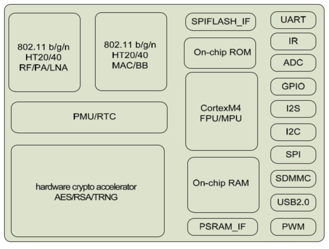

# [RDA5981](https://github.com/sochub/RDA5981) 
 

#### [Vendor](https://github.com/sochub/Vendor)：[RDA](https://github.com/sochub/RDA)
#### [Cortex](https://github.com/sochub/Cortex)：[M4](https://github.com/sochub/CM4) 
#### [Level](https://github.com/sochub/Level)：160MHz

### [RDA5981简介](https://github.com/sochub/RDA5981/wiki)

[RDA5981](https://github.com/sochub/RDA5981) 是紫光展锐一款低功耗MCU WiFi SoC。基于ARM Cortex-M4内核，可运行在160MHz主频，2016年底发布，mbed操作系统和安全网络协议栈。支持2.4G，WiFi802.11b/g/n无线标准，支持HT20/40, 支持AP/STA，是面向Wi-Fi智能音箱和Wi-Fi智能家居的高性能解决方案。

主要包括RDA5981A 和 RDA5981AM(QFN-40)两个型号

 

#### 关键特性

* Cortex M4 160MHz
* USB2.0/SDIO
* AES/RSA
* Integrated 8Mbit SPI flash in package
* 352KBytes internal SRAM for WIFI

### [收录资源](https://github.com/sochub/RDA5981)

* [参考文档](docs/)
* [参考资源](src/)

### [关联资源](https://github.com/sochub)

* [编译工具](https://github.com/sochub/arm-none-eabi)

### [选型方案](https://github.com/sochub)

* [ESP32](https://github.com/sochub/ESP32) 和 [ESP8266](https://github.com/sochub/ESP8266) 

* [RTL8710](https://github.com/sochub/RTL8710BN) 

##  [SoC资源平台](http://www.qitas.cn)

